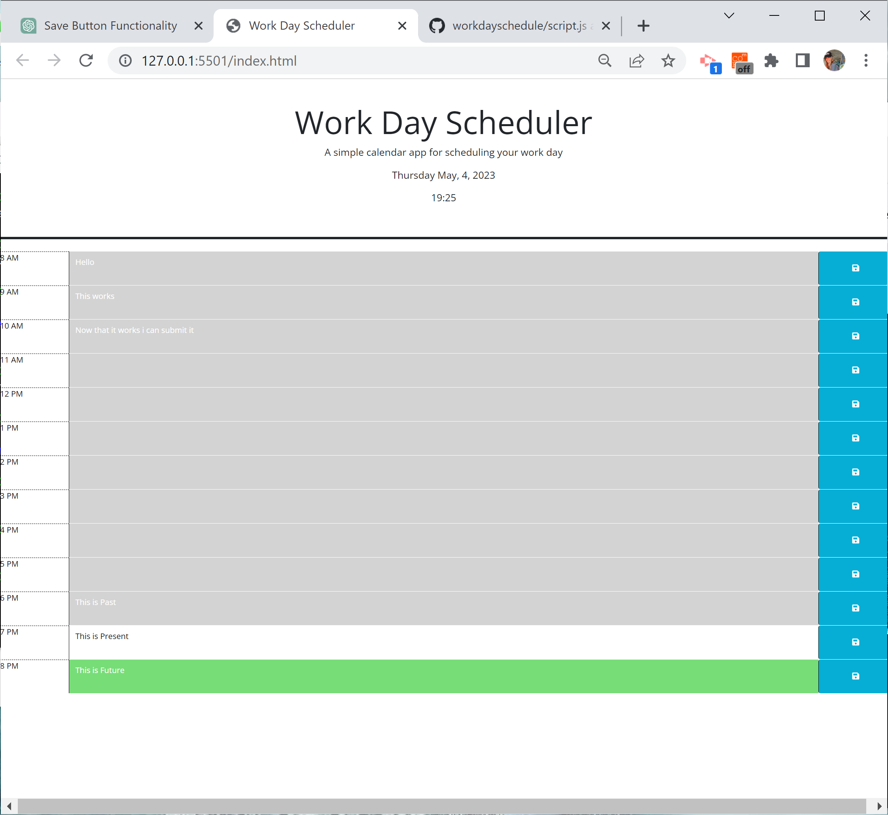

  # Work Day Scheduler
  
  
  

  ## Description
  This is a work day schedular which changes the background of each text field to either gray (past), red (current) or green (future). Enter your desired text into the time block's text feild in order to save your notes or tasks for the day to local storage.

  ## Table of Contents
   - [Description](#Description)
   - [Installation](#Installation)
   - [Usage](#Usage)
   - [License](#License)
   - [Contributing](#Contributing)
   - [Tests](#Tests)
   - [Questions](#Questions)

  ## Installation
  In order to use this application, simply clone the respository code onto your local system.

  ## Usage
  Click inside the text box to enter text and click the save button to save the text to local storage to be reviewed later.

  Screenshot of Application:
  

  ## License 
  
  

  This application is covered by the MIT license.
  
  ## Contributing
  Ideas for making this page more responsice would be idea.

  ## Tests
  N/A

  ## Questions
  Link to GitHub profile: https://github.com/keberlea
  
  If you have questions you can reach me by email at the following address: alicia.keberle@gmail.com
  